# 界面设计

1.[登录](#登录)
2.[我的](#我的)
3.[新建问卷](#新建问卷)
4.[问卷](#问卷)
5.[填写问卷](#填写问卷)
6.[我的问卷](#我的问卷)
7.[问卷统计](#问卷统计)
8.[发布寻物启事](#发布寻物启事)
9.[寻物启事](#寻物启事)
10.[修改信息](#修改信息)
11.[关于](#关于)

## 登录

## 我的

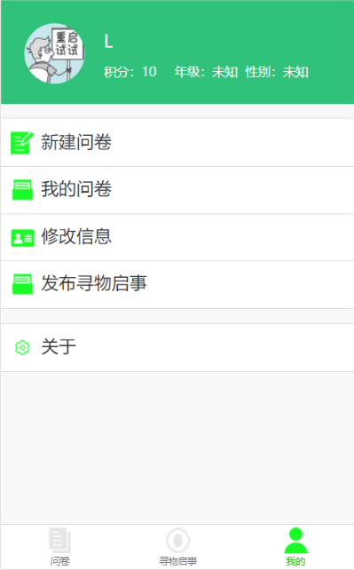

## 新建问卷

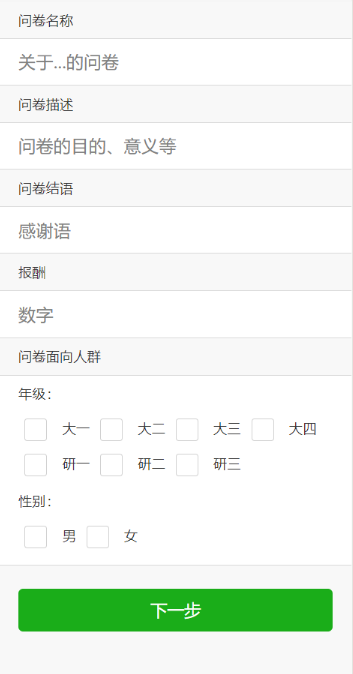

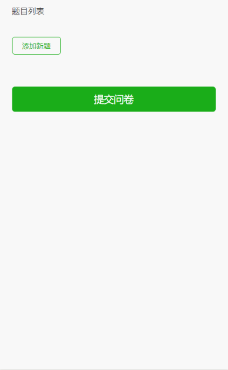

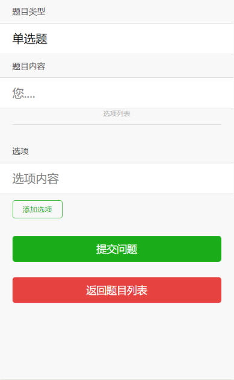

## 问卷

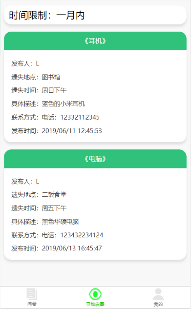

## 填写问卷

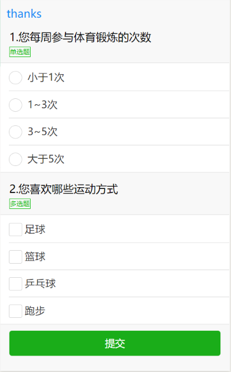

## 我的问卷

## 问卷统计

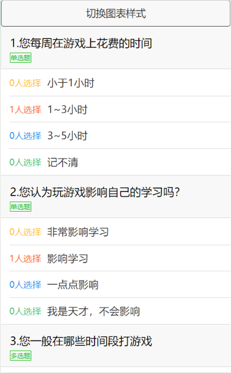

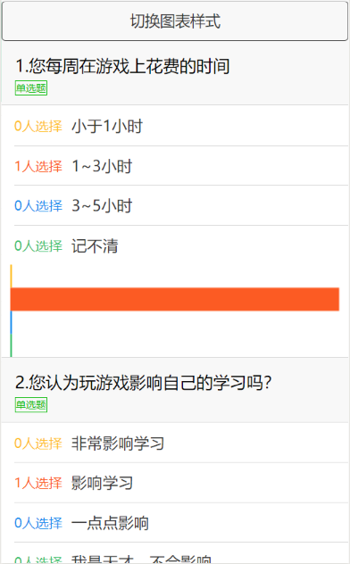

## 发布寻物启事

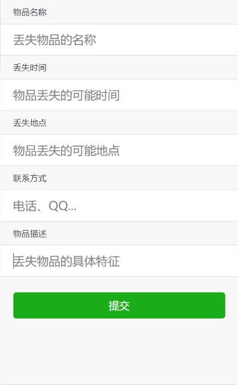

## 寻物启事

## 修改信息

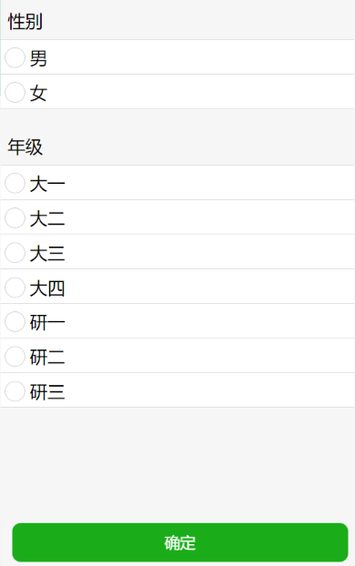

## 关于

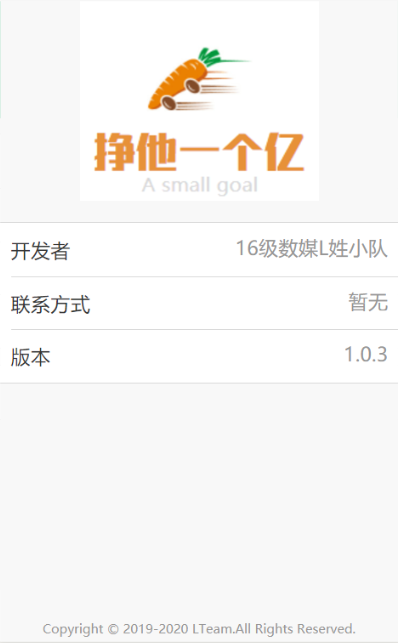
